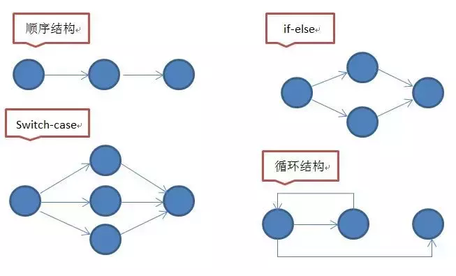

# code-metrics-loader

A webpack loader, computes complexity in JavaScript files.

### 圈复杂度定义

怎么才能写出浅显易懂的代码就不得不提软件工程质量度量方法中一个重要的概念——圈复杂度。圈复杂度（Cyclomatic complexity，简写CC）也称为条件复杂度，是一种代码复杂度的衡量标准。由托马斯·J·麦凯布（Thomas J. McCabe, Sr.）于1976年提出，用来表示程序的复杂度。它可以用来衡量一个模块判定结构的复杂程度，数量上表现为独立现行路径条数，也可理解为覆盖所有的可能情况最少使用的测试用例数。圈复杂度大说明程序代码的判断逻辑复杂，可能质量低且难于测试和维护。有研究表明复杂度和出现缺陷的数量存在强相关性，表明了越复杂的代码越可能会出错。

圈复杂度衡量的是程序中线性独立路径的数量。例如：如果程序中不包含控制、判断、条件语句，那么复杂度就是 1，因为整个程序只有一条执行路径；如果程序包含一条 IF 语句，那么就会有两条路径来执行完整个程序，所以这时候的复杂度就是 2；两个嵌套的 IF 语句，或者包含两个判断条件的一个 IF 语句，复杂度就是 2 * 2 = 4。



圈复杂度可以通过程序控制流图计算，公式为：V(G) = e + 2 - n

　　e : 控制流图中边的数量

　　n : 控制流图中节点的数量

圈复杂度对应程序控制流图中从起点到所有终点的路径的条数，所以也可以通过数路径的方式获得圈复杂度。

### 统计规则
1.基于函数维度统计圈复杂度，函数圈复杂度不包活子函数复杂度


### Install

npm i -D code-metrics-loader

### Usage

at webpack.config.js:
```js
{
  module: {
    rules: [{
      enforce: 'pre',
      test: /\.js$/,
      exclude: /node_modules/,
      use: [{
        loader: 'code-metrics-loader',
        options:{
          errorLimit: 20
        }
      }],
    }]
  }
}

```